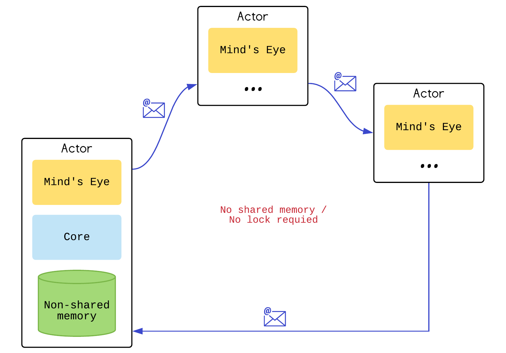
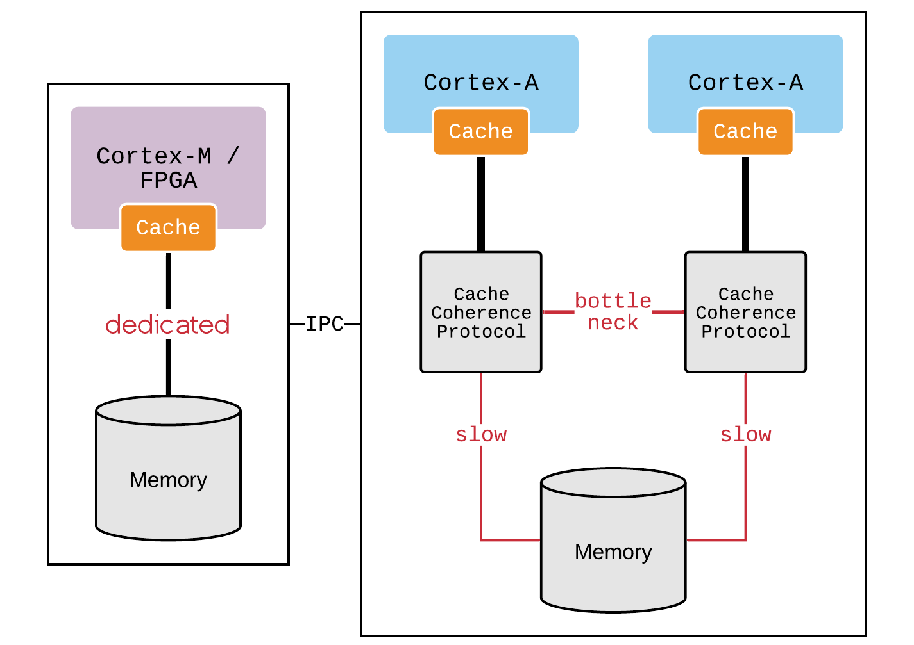
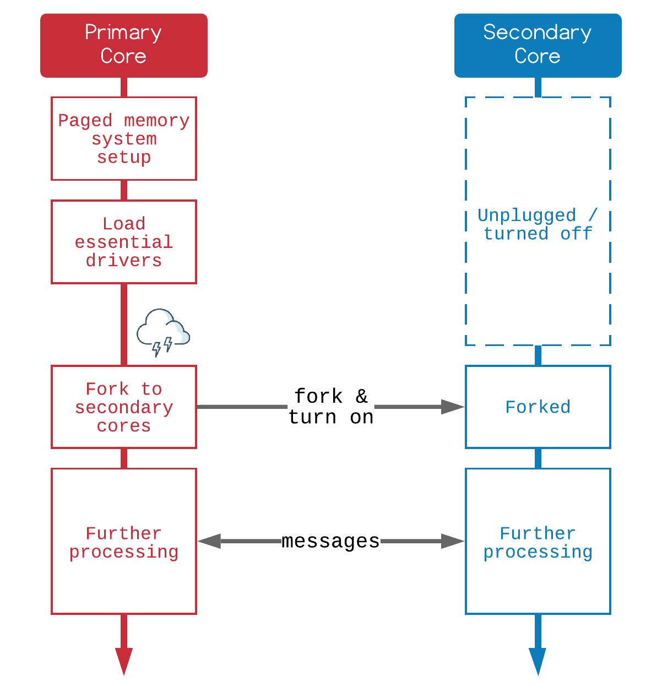

Multi-core Processing Model
###########################

Mind's Eye assumes ``non-shared`` memory by default. Which treats a multi-core machine
as a network of independent cores. Inspired by distribution based systems like Erlang
or multikernel OS. We don't encourage threading and shared memory which requires
explicit locks but rather implements ``actor`` as the universal primitives of concurrent
computation.

Symmetric multiprocessing
*************************

Mind's Eye employs multiple kernels that are dedicated for each core. Which contrasts
with traditional symmetric multiprocessing (SMP) system design when a single kernel is
used to schedule concurrent tasks. However, most of the targeted hardwares today are
built arround SMP. We could thinking about this as a restricted environment when there
is shared memory but it's usage will be limited for implement of fundamental services
likes physical page memory allocator and message passing interfaces.

Message passing isn't necessary slow while shared mutable memory isn't always fast also.
There is hidden cost in sharing memory between cores by the fact that memory access now
is very slow in compared to CPU speed. Therefore, CPU need to employs hierachy of caches
which is, at the fastest level is non-shared as well.

Every bits that we share between cores, the cached value in other cores becomes stale. So
it need to be synchronized by the cache coherence protocol, which is just message passing
too. Besides, we need to explicitly use memory barrier to make that work, which is source
of mistakes. Abuse of shared memory even worse if we consider about the fragmented nature
of that. Which means CPU will accidentally flush not only the stale values, but also not
related values on the same cache line, and also many cache lines since it was fragmented.

`Benchmark of multikernel`_ shows interesting result for the scalability with multicore.
Message passing overhead nowadays are reasonable with support of paged memory and help
from hypervisor. It's zero-copy operation in Mind's Eye, we just swap a page table from
the sender to recipient then let the cache coherence protocol do its jobs.

Multikernels by fork
********************

Whenever a secondary core is required, its kernel is forked from the kernel on primary
core. It's mostly similar to forking of process on POSIX system, with differences. The
motivation behind forking in Mind's Eye is to limit shared mutable state. By inherits
state from original core in the way that further modifications to ``not required to
share state`` will work on another physical memory buffer that was mapped to the same
virtual address as the primary core. Hence, forked kernel works with that copy instead
of messing with other cores.

In ideal cases, multikernel system may NOT need to forking at all since the code segment
is strictly immutable. Mind's Eye breaks it with Objective-C, a language that very closes
to C but also very dynamic. Its powerful runtime and message passing ABI is naturally fits
for Mind's Eye multikernel design. Unfortunately, this kind of runtime must be mutable.
Even worse for Objective-C as its initial setup routines will be called only once at the
startup by static constructors.

Kernel forking solves this issue by inherits the runtime in ``copy then write`` manner.
On the secondary core, what required is a runtime that just works, it doesn't care if
the forked runtime is not identical to the original version after sub-sequence writes.
As long as inter-core communication wasn't break. Which is fortunately not related.

Mind's Eye forking is different from POSIX as it only care about inheritance of the state,
and not about execution flow. After being forked, the secondary core will start from its
specified entry point with different stack also. It's not a completely forked of the address
space since we are not going to leaves the hypervisor mode, it provides no more isolation.

.. _Benchmark of multikernel: https://www.sigops.org/s/conferences/sosp/2009/papers/baumann-sosp09.pdf