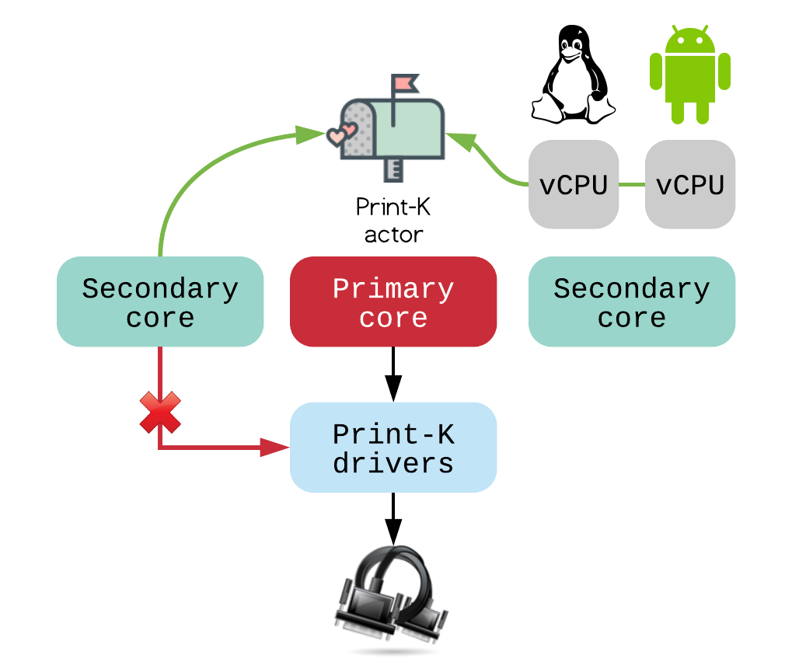

Tracing and Logging
###################

The Mind's Eye hypervisor provides log capabilities over Print-K sub-system.

Primary core
************

Log device is abstracted by Print-K driver (write-only).

Print-K driver is owned by the primary core. In the early stage, there is a special
driver named ``printk_early`` that stores log directly to RAM. If for any reason the
system failed to reach the good state and no concrete log device is available, we still
have an option to read log with a debugger. Which could be used for debugging of the
concrete log driver as well.

Secondary core & vCPU
*********************

Directly access to ``printf`` function from the secondary cores and vCPUs are banned no
matter whether these functions or Print-K drivers are reentrant or not. Because, we don't
want to use shared resource. Therefore, from out side of the primary core we need to use
message passing. Log APIs (``pr_*``) in the hypervisor must accounts this constraint.

Driver memory allocation
************************

.. figure:: images/trace_log_mem.png
   :align: center

Memory used by Print-K driver is statically allocated from the linker script. Which's
size is configurable with a compile option. This memory buffer is loosely divided to two
sections, with driver context resides in the bottom, while early log starts from the top.
Driver context will only be allocated during migration from early to concrete driver.
That means log message in the bottom will be overwritten, if it reaches there. Afterthat,
log traffic will be redirected to the concrete driver.